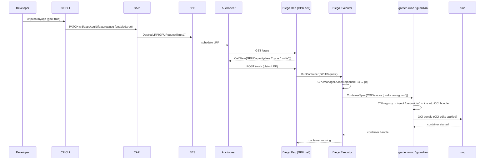

# Architecture – cf-gpuccino GPU Support for Cloud Foundry

## Overview

cf-gpuccino extends the Cloud Foundry container runtime stack to schedule, allocate, and expose GPU devices to application containers. It follows the CDI (Container Device Interface) standard for device injection, keeping the device-injection path portable across NVIDIA and AMD GPUs.

> **Resource model note:** the POC requests a GPU with a boolean **app feature flag**
> (`gpu_enabled`, on/off), implemented on the upstream `cloud_controller_ng` `gpu-flag`
> branch. A richer model (an explicit count like `gpu: N`, or a `gpu_type`) is a
> deliberately-open RFC question, not part of the POC. This document describes the
> feature-flag path as actually built.

---

## End-to-End Flow

### Step 1 – Developer pushes with GPU enabled

```bash
cf push myapp -f manifest.yml
# manifest.yml:
#   applications:
#   - name: myapp
#     gpu: true
```

The CF CLI enables the GPU app feature via CAPI's app-features API
(`PATCH /v3/apps/:guid/features/gpu` with body `{"enabled": true}`).

### Step 2 – CAPI persists the GPU request

CAPI records the flag on the app (the `gpu_enabled` column) and carries it into the
Diego app recipe, which embeds a GPU request in the `DesiredLRP` sent to BBS. The GPU
vendor is not part of the request: it is a property of the foundation's GPU cells, not
something the developer names.

### Step 3 – Diego Auctioneer selects a GPU cell

The Auctioneer fetches cell state from every Diego Rep.  GPU cells include a `GPUCapacity` field (`TotalGPUs`, `FreeGPUs`, `GPUType`) in their state response.  The Auctioneer gates placement so a GPU-requesting LRP can only win a cell that has GPU capacity:

- Cell must have `FreeGPUs >= 1`.
- Non-GPU LRPs are unaffected and place as before.

### Step 4 – Diego Executor allocates the GPU

The winning Rep instructs its Executor to create a container.  The Executor calls `GPUManager.Allocate(containerHandle, 1)` which:

1. Finds a free GPU index (e.g. 0).
2. Records `allocated[0] = containerHandle`.
3. Returns `[]uint{0}`.

### Step 5 – garden-runc creates the container

The Executor builds a `ContainerSpec` with:

```go
CDIDevices: []garden.CDIDevice{{Name: "nvidia.com/gpu=0"}}
Env: []string{"CUDA_VISIBLE_DEVICES=0"}
```

garden-runc receives the CDI device name and, in this POC, resolves and applies the CDI edits at the guardian layer using the upstream `tags.cncf.io/container-device-interface` library (rather than delegating to runc's native CDI support).

### Step 6 – CDI name is resolved to device edits

The CDI library reads the CDI registry (backed by `/var/vcap/data/cdi/specs/nvidia-gpu.json`) and injects into the container:

- Device node `/dev/nvidia0` (char, 195:0)
- Device node `/dev/nvidiactl` (char, 195:255)
- Device node `/dev/nvidia-uvm` (char, 510:0)
- Bind-mount `/usr/local/cuda/lib64` → `/usr/local/cuda/lib64`
- Environment: `CUDA_VISIBLE_DEVICES=0`, `LD_LIBRARY_PATH=…`

### Step 7 – App runs with GPU access

The application container sees `/dev/nvidia0` and the CUDA library tree. A PyTorch script can call `torch.cuda.is_available()` and get `True`.

### Step 8 – Metrics are collected

`GPUMetricsCollector.Collect()` reads utilisation and memory for each allocated GPU (via NVML in production) and calls `EmitToLoggregator()` to forward gauge envelopes to Log Cache. Developers view metrics with:

```bash
cf log-cache myapp --envelope-type gauge | grep gpu
```

---

## Sequence Diagram



---

## Component Interaction Details

### BBS ↔ CAPI

CAPI carries the app's `gpu_enabled` flag into the Diego app recipe, which embeds a
`GPURequest` in the `DesiredLRP`. The request is a simple "needs a GPU" marker; the
vendor/type is resolved by which GPU cells exist in the foundation, not by the request.

### Rep ↔ Auctioneer

The Diego Rep's `/state` handler is extended to include `GPUCapacity` in the `CellState` JSON. The Auctioneer's scoring gates GPU cell selection so a GPU-requesting LRP only wins a cell with free GPU capacity.

### Executor ↔ GPUManager

The Executor holds a single `*GPUManager` per cell. All container creation and deletion calls synchronise through the manager's mutex.

### garden-runc / guardian ↔ CDI

In this POC, guardian resolves the `CDIDevices` names and applies the CDI edits (device nodes, mounts, env) to the OCI bundle itself, via the `tags.cncf.io/container-device-interface` library, before invoking runc. runc ≥ 1.1.0 also has built-in CDI support, so an alternative integration is to pass CDI names through and let runc apply them; which approach CF standardizes on is a follow-up design decision.

---

## CGroup v1 vs v2

| Feature | CGroup v1 | CGroup v2 |
|---|---|---|
| Device allow-list | `devices.allow` / `devices.deny` | eBPF `BPF_PROG_TYPE_CGROUP_DEVICE` program |
| GPU device isolation | Per-container `devices.allow c 195:* rwm` | eBPF program filters device access per cgroup |
| Complexity | Simpler to implement | Requires kernel ≥ 5.2; runc handles automatically |

CDI abstracts over both: the CDI spec defines device nodes and permissions; runc/crun applies the right cgroup mechanism based on the host kernel.

---

## CDI Approach Explanation

CDI (Container Device Interface) decouples *how* a device is exposed from *which* device is requested:

1. **CDI spec files** (JSON, in `/etc/cdi/` or `/var/vcap/data/cdi/specs/`) describe for each named device:
   - Device nodes to inject (`deviceNodes`)
   - Filesystem mounts (`mounts`)
   - Environment variables (`env`)

2. **A CDI consumer** reads the spec and applies all edits before the container starts. This can be the runtime itself (runc ≥ 1.1.0 has built-in CDI support) or a CDI library invoked one layer up; this POC does the latter, in guardian.

3. **Orchestrator** (garden-runc / Executor) only needs to reference the *name* `"nvidia.com/gpu=0"`; it never hard-codes device numbers.

This makes GPU support portable: changing the CDI spec is enough to update the device topology without redeploying Diego or garden-runc.
