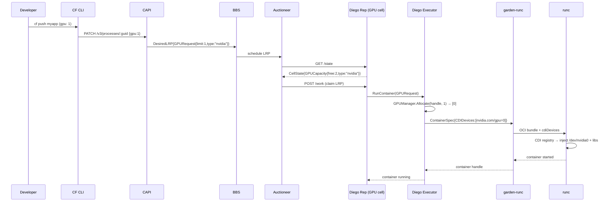

# Architecture – cf-gpuccino GPU Support for Cloud Foundry

## Overview

cf-gpuccino extends the Cloud Foundry container runtime stack to schedule, allocate, and expose GPU devices to application containers. It follows the CDI (Container Device Interface) standard for device injection, keeping the solution portable across NVIDIA and AMD GPUs.

---

## End-to-End Flow

### Step 1 – Developer pushes with GPU request

```bash
cf push myapp -f manifest.yml
# manifest.yml:
#   resources:
#     gpu: 1
#     gpu_type: nvidia
```

The CF CLI sends `PATCH /v3/processes/:guid` with body `{"gpu": 1, "gpu_type": "nvidia"}` to CAPI.

### Step 2 – CAPI persists the GPU request

CAPI validates the request (`GPUResources.Validate()`), stores it in the CC database, and converts it into a `GPURequest` protobuf message that is embedded in the `DesiredLRP` sent to BBS.

### Step 3 – Diego Auctioneer selects a GPU cell

The Auctioneer fetches cell state from every Diego Rep.  GPU cells include a `GPUCapacity` field (`TotalGPUs`, `FreeGPUs`, `GPUType`) in their state response.  The Auctioneer uses `BidForGPU(available, requested, requestedType)` to filter cells:

- Cell must have `FreeGPUs >= 1`.
- Cell's `GPUType` must be `"nvidia"` (or the request's `gpu_type` is empty).

### Step 4 – Diego Executor allocates the GPU

The winning Rep instructs its Executor to create a container.  The Executor calls `GPUManager.Allocate(containerHandle, 1)` which:

1. Finds a free GPU index (e.g. 0).
2. Records `allocated[0] = containerHandle`.
3. Returns `[]uint{0}`.

### Step 5 – garden-runc creates the container

The Executor builds a `ContainerSpec` with:

```go
CDIDevices: []garden.CDIDevice{{Name: "nvidia.com/gpu=0"}}
Env: []string{"CUDA_VISIBLE_DEVICES=0"}
```

garden-runc passes the CDI device name to runc via the OCI bundle's `linux.cdiDevices` field.

### Step 6 – runc resolves the CDI name

runc reads the CDI registry (backed by `/var/vcap/data/cdi/specs/nvidia-gpu.json`) and injects into the container:

- Device node `/dev/nvidia0` (char, 195:0)
- Device node `/dev/nvidiactl` (char, 195:255)
- Device node `/dev/nvidia-uvm` (char, 510:0)
- Bind-mount `/usr/local/cuda/lib64` → `/usr/local/cuda/lib64`
- Environment: `CUDA_VISIBLE_DEVICES=0`, `LD_LIBRARY_PATH=…`

### Step 7 – App runs with GPU access

The application container sees `/dev/nvidia0` and the CUDA library tree. A PyTorch script can call `torch.cuda.is_available()` and get `True`.

### Step 8 – Metrics are collected

`GPUMetricsCollector.Collect()` reads utilisation and memory for each allocated GPU (via NVML in production) and calls `EmitToLoggregator()` to forward gauge envelopes to Log Cache. Developers view metrics with:

```bash
cf log-cache myapp --envelope-type gauge | grep gpu
```

---

## Sequence Diagram



---

## Component Interaction Details

### BBS ↔ CAPI

The `GPURequest` protobuf message is embedded in `DesiredLRPRunInfo`. CAPI serialises the CF v3 `gpu` / `gpu_type` fields into this message when constructing the LRP.

### Rep ↔ Auctioneer

The Diego Rep's `/state` handler is extended to include `GPUCapacity` in the `CellState` JSON. The Auctioneer's scoring function calls `BidForGPU` to gate GPU cell selection.

### Executor ↔ GPUManager

The Executor holds a single `*GPUManager` per cell. All container creation and deletion calls synchronise through the manager's mutex.

### garden-runc ↔ runc (CDI)

garden-runc passes `CDIDevices` names through to the OCI runtime config. runc ≥ 1.1.0 has built-in CDI support; older versions require the nvidia-container-runtime wrapper.

---

## CGroup v1 vs v2

| Feature | CGroup v1 | CGroup v2 |
|---|---|---|
| Device allow-list | `devices.allow` / `devices.deny` | eBPF `BPF_PROG_TYPE_CGROUP_DEVICE` program |
| GPU device isolation | Per-container `devices.allow c 195:* rwm` | eBPF program filters device access per cgroup |
| Complexity | Simpler to implement | Requires kernel ≥ 5.2; runc handles automatically |

CDI abstracts over both: the CDI spec defines device nodes and permissions; runc/crun applies the right cgroup mechanism based on the host kernel.

---

## CDI Approach Explanation

CDI (Container Device Interface) decouples *how* a device is exposed from *which* device is requested:

1. **CDI spec files** (JSON, in `/etc/cdi/` or `/var/vcap/data/cdi/specs/`) describe for each named device:
   - Device nodes to inject (`deviceNodes`)
   - Filesystem mounts (`mounts`)
   - Environment variables (`env`)

2. **Container runtime** (runc ≥ 1.1.0) reads the spec and applies all edits before starting the container.

3. **Orchestrator** (garden-runc / Executor) only needs to pass the *name* `"nvidia.com/gpu=0"` — it never hard-codes device numbers.

This makes GPU support portable: changing the CDI spec is enough to update the device topology without redeploying Diego or garden-runc.
